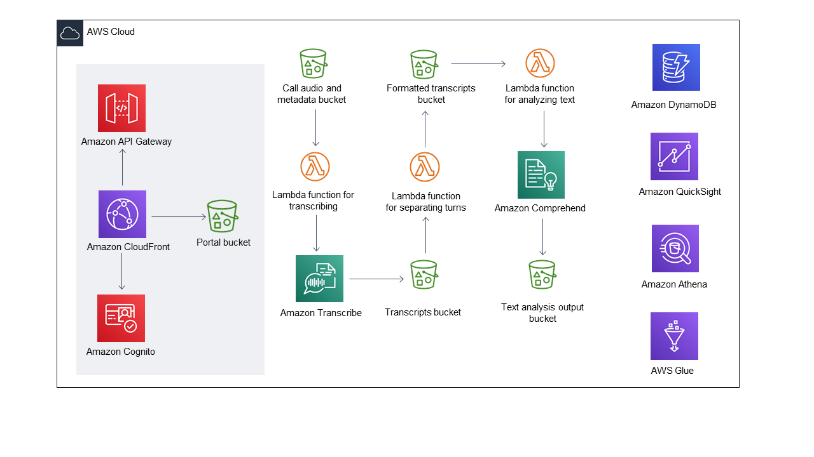

Deploying this Quick Start with default parameters builds the following {partner-product-name} environment in the AWS Cloud.

// Replace this example diagram with your own. Send us your source PowerPoint file. Be sure to follow our guidelines here : http://(we should include these points on our contributors giude)
[#architecture1]
.Quick Start architecture for {partner-product-name} on AWS
[link=images/onica-architecture-diagram.png]

As shown in Figure 1, the Quick Start sets up the following:

* For the portal website where users upload audio recordings:
** An Amazon CloudFront distribution to serve HTTPS requests to an Amazon S3 bucket that hosts the contents of the portal website.
** Amazon API Gateway that exposes provisioning endpoints through HTTPS.
** Amazon Cognito to manage users and give access to the portal website.
** An S3 bucket to host the portal website.
* An S3 bucket that stores contact center audio recordings and metadata.
* An AWS Lambda function that transcribes the audio recordings to call transcripts.
* Amazon Transcribe for creating high-quality transcripts.
* An S3 bucket that stores the transcripts.
* A Lambda function that separates turns from the transcript.
* An S3 bucket that stores the separated (formatted) turn transcripts.
* A Lambda function that analyses the separated transcripts.
* Amazon Comprehend for analyzing interactions within the transcript.
* An S3 bucket that stores the text analysis output.
* Additional AWS services: 
** An Amazon DynamoDB table that stores audio Uniform Resource Identifier (URI), transcript URI, text analysis URI, and job status.
** An AWS Glue crawler that pulls metadata from the text analysis and DynamoDB table.
** An Amazon Athena query that fetches turn-by-turn sentiment and scores.
** Amazon QuickSight for viewing dashboards and reports from post-call data.

